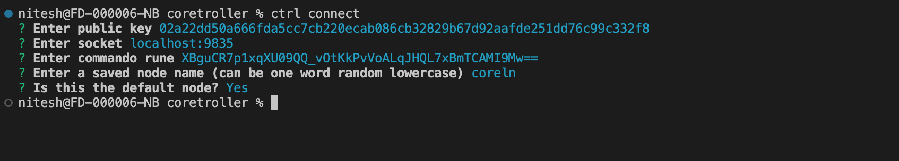

# Coretroller

Commands for working with core-lightning node.

[](https://badge.fury.io/js/coretroller)

## Install

- Requires an [installation of Node v14.00+][nodejs-install-guide]

```shell
npm install -g coretroller
```

Re-install if you want to update to a new version.

Get the version to verify that it's installed:

```shell
# current installed version
ctrl --version
``` 

## Setup
Run the `ctrl connect` command and follow instructions to enter paths to certificates and gRPC port details.

Example setup:
  

- coretroller supports controlling multiple nodes.
- setting node name in above screenshot gives an alias name to use in commands.
- to specify a saved node while running commands, use the `--node` flag. 
- setting a node as default will not require the `--node` flag to run commands for that node.
- if you have two nodes and you named them `coreln` (default) and `coreln2`, you can run commands like this: `ctrl balance --node coreln2` or just `ctrl balance` if you are controlling the default node.

## Supported commands

```shell
# See onchain and offchain balances
ctrl balance

# Receive on-chain funds via a regular address
ctrl chain-deposit

# Connect to core-lightning
ctrl connect

# Tags can be used in other commands via tag and avoid options
ctrl tags
```


[nodejs-install-guide]: https://gist.github.com/alexbosworth/8fad3d51f9e1ff67995713edf2d20126